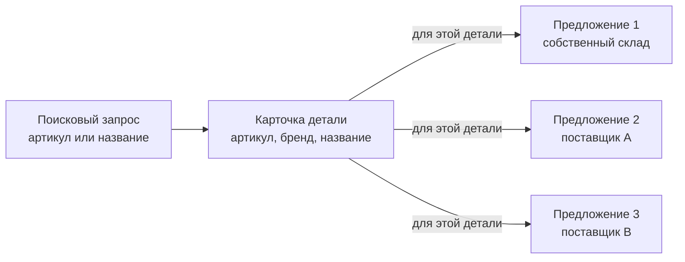
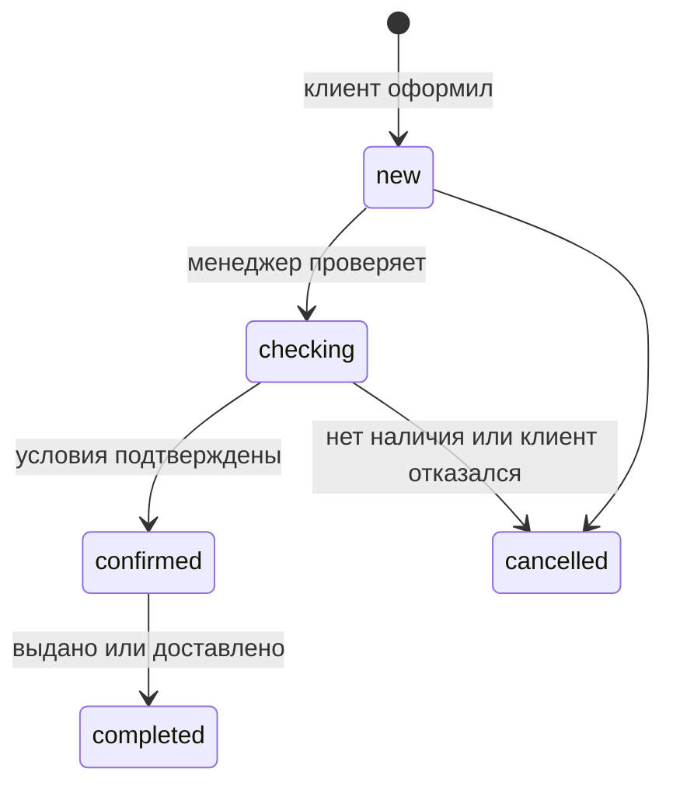

# Как устроен будущий магазин

Этот документ объясняет простыми словами, какие данные понадобятся магазину запчастей и почему. Он нужен, чтобы менеджер, владелец продукта и разработчик одинаково понимали слова «деталь», «предложение» и «заказ».

Это не схема базы данных и не описание API. Поля таблиц, индексы и технические интеграции определяются отдельно, когда будут выбраны первые поставщики и формат обмена с 1С.

## Главное различие

**Деталь** — это то, что ищет клиент: например, тормозная колодка определённого бренда и артикула.

**Предложение** — это возможность купить эту деталь у конкретного источника на конкретных условиях: за определённую цену, в наличии или с определённым сроком поставки.

У одной детали может быть несколько предложений. Одно предложение может прийти от собственного склада, другое — от внешнего поставщика. Клиент всегда видит одну карточку детали, а внутри неё — доступные варианты покупки.

## Словарь

| Понятие | Что это означает | Пример |
| --- | --- | --- |
| **Карточка детали** (`Product`) | Единая карточка найденной детали: артикул, бренд, название и описание. Она отвечает на вопрос «что это?». | `Brembo P 85 020`, тормозные колодки. |
| **Поставщик** (`Supplier`) | Источник, от которого получаем данные или товар. | Собственный склад, Adeo, Mikado. |
| **Предложение** (`Offer`) | Актуальные условия продажи конкретной детали у поставщика. | 2 шт., 4 500 ₽, доставка 2 дня. |
| **Правило наценки** (`MarkupRule`) | Правило, по которому цена поставщика превращается в цену для клиента. | +15%, округление до 10 ₽. |
| **Корзина** (`Cart`) | Временный выбор клиента до оформления. | Клиент добавил два предложения. |
| **Заказ** (`Order`) | Запрос клиента на покупку после проверки условий. | Заказ №123, ожидает подтверждения менеджера. |
| **Позиция заказа** (`OrderItem`) | Одна строка уже созданного заказа. Хранит зафиксированные цену, количество и срок на момент оформления; они не меняются вместе с текущим предложением. | Колодки, 2 шт., 4 500 ₽, 2 дня. |
| **Импорт** (`ImportRun`) | Один запуск загрузки данных из 1С или от поставщика. | Ночная загрузка остатков со своего склада. |

## Как данные живут

### 1. Поиск и предложения

Клиент ищет деталь по артикулу или названию. Система сопоставляет результаты собственного склада и поставщиков по бренду и нормализованному артикулу и показывает единую карточку детали. Внутри карточки она показывает отдельные предложения с ценой, наличием и сроком. Аналоги и похожие детали не объединяются с ней автоматически: для них нужны отдельные правила.

Цена, остаток и срок в предложении могут меняться. Поэтому у каждого предложения есть время получения данных и срок, до которого они считаются актуальными.

### 2. Корзина

Клиент кладёт в корзину не абстрактную деталь, а выбранное предложение. В корзине сохраняются предложение и количество.

Когда клиент меняет корзину или начинает оформление, система заново проверяет цену, наличие и срок. Если условия изменились, клиент видит это до создания заказа.

### 3. Заказ

После повторной проверки создаётся заказ. В каждой его позиции сохраняется снимок условий на тот момент: поставщик, артикул, бренд, название, цена, количество и срок поставки.

Это важно: позднее изменение цены, каталога или правила наценки не должно менять уже созданный заказ.

### 4. Импорт

Собственный каталог, цены и остатки могут поступать из 1С; данные поставщиков — из API или прайс-листа. Каждый запуск загрузки записывается отдельно: откуда пришли данные, когда начался и завершился, сколько записей обработано и были ли ошибки.

Если импорт завершился с ошибкой, он не должен частично заменять актуальные данные.

## Правила, которые нельзя нарушать

1. Деталь и предложение — не одно и то же: одна деталь может иметь несколько предложений.
2. Каждое предложение относится к одной карточке детали; собственный склад и поставщики отображаются внутри этой карточки.
3. Браузер не определяет цену, наличие и срок: перед заказом их проверяет сервер.
4. Просроченное предложение нельзя оформить без обновления условий.
5. Заказ хранит собственный снимок условий и не меняется вместе с каталогом.
6. Изменения поставщиков и правил наценки доступны только сотрудникам с нужными правами и записываются в журнал.
7. Персональные данные клиентов и секреты интеграций хранятся отдельно и доступны ограниченному кругу сотрудников.

## Что пока не входит в модель

Пока не определены правила для подбора по VIN, совместимости с автомобилем, аналогов и OEM-номеров, оплаты, доставки и автоматического заказа у поставщика. Их добавляют отдельными моделями только после согласования бизнес-процесса.

## Что решить перед реализацией

Перед созданием базы данных и API нужно согласовать:

1. первого поставщика и способ получения его предложений;
2. источник собственного каталога — 1С, файл или другая система;
3. правила выбора и округления наценки;
4. как менеджер подтверждает или отменяет заказ;
5. какие данные клиент оставляет при оформлении.
