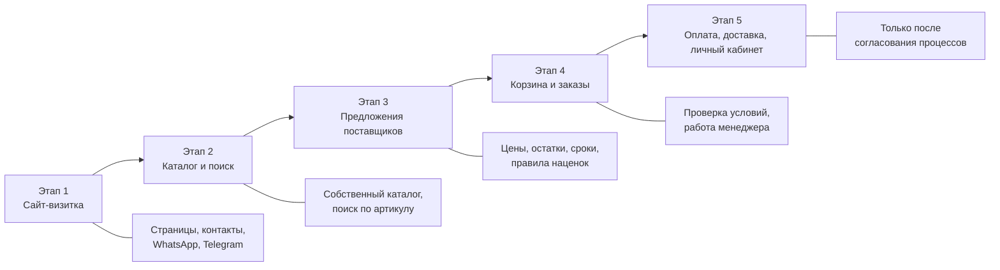
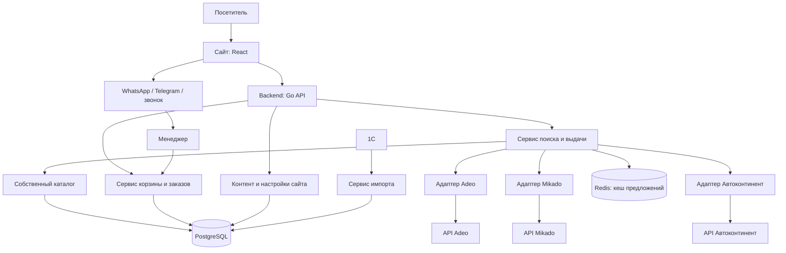
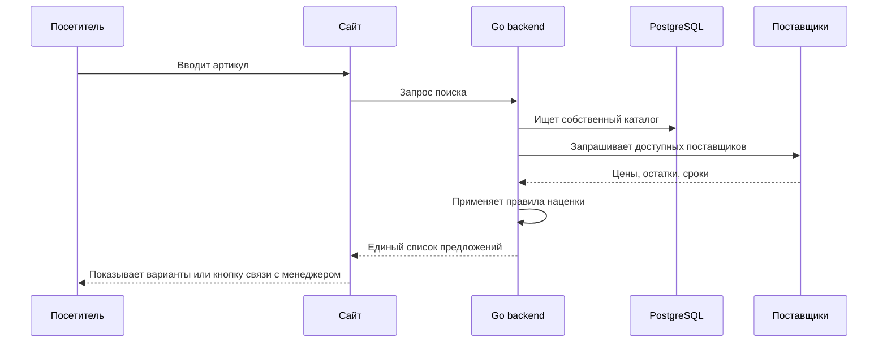
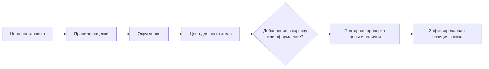
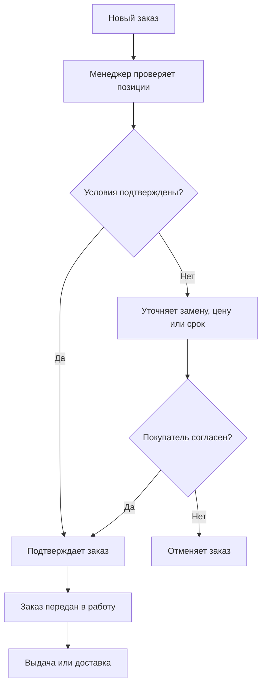

# Расширенная схема развития сайта и будущих интеграций

## Идея

Сайт запускается как визитка с прямой связью с менеджерами. Затем к той же основе поэтапно добавляются поиск, предложения поставщиков, корзина и заказы. Посетитель не должен замечать технические изменения: ему по-прежнему доступен быстрый способ написать менеджеру.

## Развитие по этапам



## Целевая схема работы



## Что происходит при поиске детали



## Роль внешних поставщиков

Каждый поставщик подключается отдельным адаптером. Это означает, что особенности его API не попадают в сайт и не меняют интерфейс для посетителя.

```text
Единый поиск сайта
        ↓
Контракт поставщика: найти деталь → вернуть предложения
        ↓
Адаптер конкретного поставщика → его API
```

Все адаптеры возвращают данные в одном виде:

- поставщик и артикул;
- бренд и наименование;
- исходная цена и итоговая цена;
- доступное количество;
- срок поставки;
- время, когда эти данные были получены.

Поэтому можно подключать поставщиков постепенно. В первом релизе магазина достаточно одного; остальные добавляются без переработки корзины и сайта.

## Как формируется цена



Цена, остаток и срок поставки не принимаются из браузера. Перед заказом backend повторно проверяет условия, поскольку внешние данные могут измениться.

## Обмен с 1С

1. 1С передаёт собственный каталог, цены и остатки в согласованном формате.
2. Сервис импорта проверяет данные и записывает результат запуска.
3. PostgreSQL хранит актуальные товары собственного склада.
4. Поиск показывает собственный склад вместе с предложениями внешних поставщиков.
5. Ошибки импорта попадают в журнал, а не изменяют каталог частично.

Подключение 1С — отдельный этап: сначала необходим тестовый контур и согласованный формат выгрузки.

## Работа менеджера после появления магазина



Автоматическое оформление заказа у внешнего поставщика на ранних этапах не планируется: менеджер сохраняет контроль над подтверждением.

## Границы ответственности

| Участник | За что отвечает |
| --- | --- |
| Сайт | Показывает информацию, поиск, предложения и способы связи. |
| Go backend | Проверяет данные, применяет правила, управляет корзиной и заказами. |
| PostgreSQL | Хранит контент, собственный каталог, настройки, корзины и заказы. |
| Поставщики | Передают свои предложения, цены, сроки и остатки. |
| 1С | Передаёт данные собственного склада. |
| Менеджер | Подтверждает итоговые условия и сопровождает заказ. |

## Что определить перед следующими этапами

Для первого этапа нужны только контент и рабочие контакты менеджеров. Для будущего магазина позже потребуется определить:

1. Какие поставщики являются приоритетными и есть ли доступ к их API.
2. Откуда будет поступать собственный каталог: 1С, файл или другая система.
3. Какой менеджер и в какие часы подтверждает заказы.
4. В каких случаях цена или срок могут быть изменены после запроса покупателя.
5. Когда потребуется онлайн-оплата и интеграция со службами доставки.

Эта схема — план развития, а не обязательство запускать все этапы сразу. Каждый следующий этап можно начинать после подтверждения ценности предыдущего.
